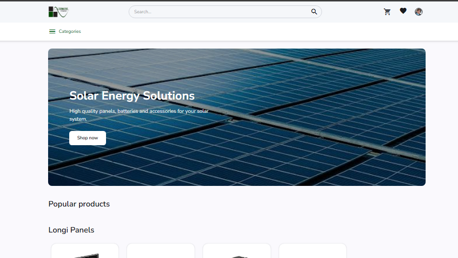
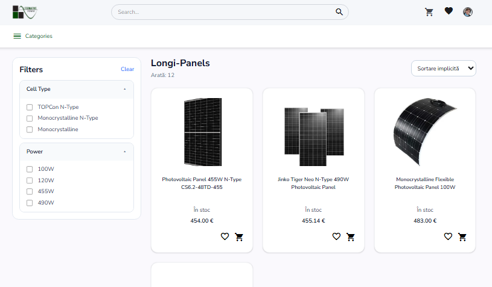
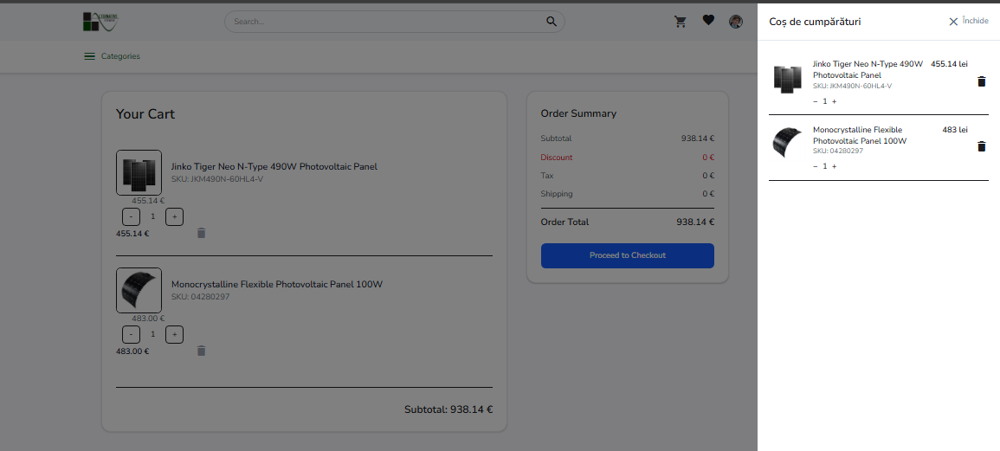
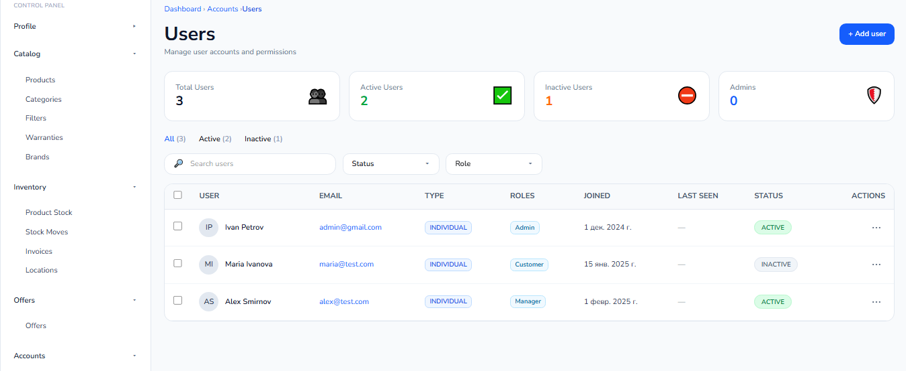
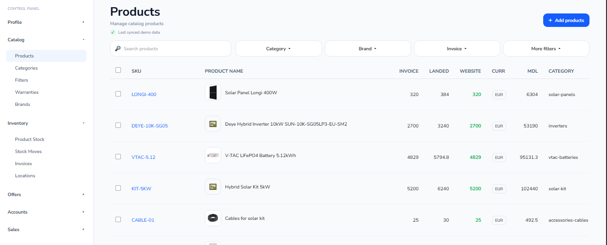
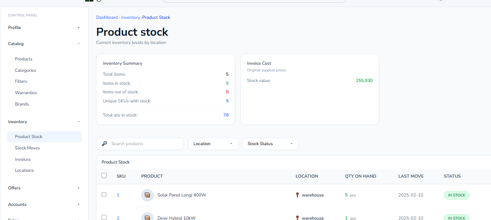
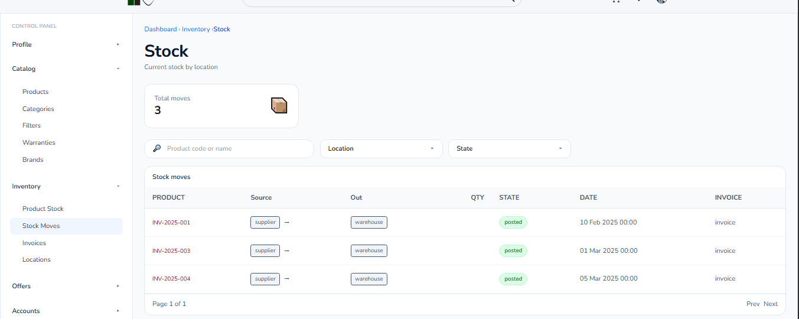
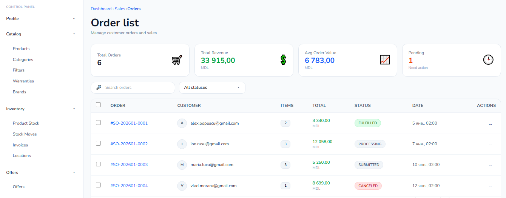
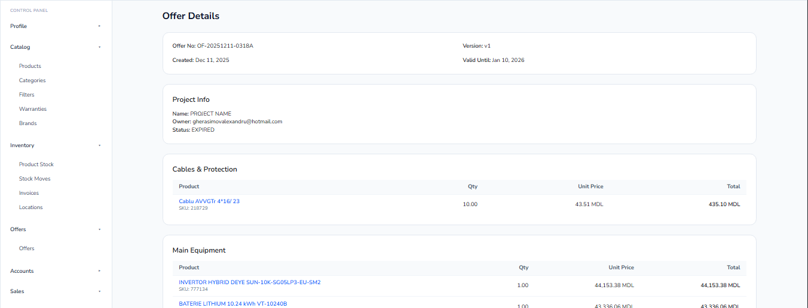

# Client

This project was generated using [Angular CLI](https://github.com/angular/angular-cli) version 21.0.4.  
It is a **large-scale Angular e-commerce platform** for solar equipment (and other products), featuring both a **customer-facing storefront** and a **comprehensive admin dashboard**.

[**Live Demo**](https://mistercat752.github.io/alternative-power-angular/)

---

## Project Overview

- Customer storefront with **categories, filters, search, cart, and wishlist**
- Admin dashboard with **20+ pages** for managing warehouse, stock, orders, offers, users, and analytics
- Role-based access for **admins, managers, and moderators**
- Fully mocked backend for front-end development and testing
- Scalable UI and architecture designed for future expansion

---

## Customer-Facing Store

### Home & Catalog

Browse products, apply filters, search, add to cart or wishlist

| Home Page                                                   | Catalog Page                                                 |
| ----------------------------------------------------------- | ------------------------------------------------------------ |
|  |  |

### Cart

Manage cart items and wishlist products

| Cart                                                   |
| ------------------------------------------------------ |
|  |

---

## Admin Dashboard

### User & Account Management

View users, assign roles, activate/deactivate accounts

| Users Page                                               |
| -------------------------------------------------------- |
|  |

### Catalog Management

Full CRUD for **products, brands, categories, filters, warranties, units**

| Product CRUD                                                           |
| ---------------------------------------------------------------------- |
|  |

### Inventory & Stock

Manage **locations, stock, purchase orders, stock movements**, invoices automatically update stock

| Inventory Page                                                   | Stock Moves                                                          |
| ---------------------------------------------------------------- | -------------------------------------------------------------------- |
|  |  |

### Sales & Offers

View **sold orders**, track fulfillment, manage offers, analytics

| Sales Dashboard                                          | Offers Detail Page                                         |
| -------------------------------------------------------- | ---------------------------------------------------------- |
|  |  |

---

## Development server

To start a local development server, run:

npm install

```bash
ng serve
```
